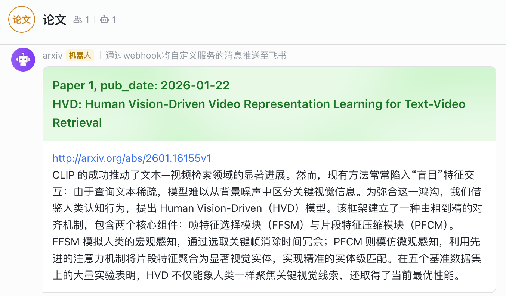

# Track arXiv

一个自动追踪 arXiv 论文并推送到飞书的工具。该工具会自动搜索最新的 arXiv 论文，使用 AI 将摘要翻译成中文，并通过飞书机器人发送通知。




## ✨ 功能特性

- 🔍 **自动搜索**：定期搜索 arXiv 上的最新论文
- 🌐 **智能翻译**：使用 OpenAI API 将论文摘要翻译成中文
- 📱 **飞书推送**：自动发送格式化的论文信息到飞书群组
- 🔄 **去重机制**：自动过滤已推送的论文，避免重复
- 💾 **历史记录**：保存所有处理过的论文到本地 JSON 文件

## 📋 前置要求

- Python 3.x
- OpenAI API 密钥（或兼容的 API 服务）
- 飞书机器人 Webhook URL

## 🚀 快速开始

### 1. 克隆/Fork项目

```bash
git clone https://github.com/jetxa/track-arxiv.git
```

### 2. 配置GitHub Actions

#### 添加工作流

Actions - New workflow

#### 环境变量

settings - Security - Secrets and variables - Actions - New Repository Secret

- MODEL_NAME
- BASE_URL
- API_KEY
- BOT_URL
- MAX_RESULT


## ⚙️ 配置说明

### 环境变量

| 变量名 | 说明 | 必需 | 默认值 |
|--------|------|------|--------|
| `MODEL_NAME` | OpenAI 兼容 API 的模型名称 | ✅ | - |
| `BASE_URL` | API 服务的基础 URL | ✅ | - |
| `API_KEY` | API 访问密钥 | ✅ | - |
| `BOT_URL` | 飞书机器人 Webhook URL | ✅ | - |
| `MAX_RESULT` | 单次搜索返回的最大论文数 | ❌ | 20 |

### 搜索查询

默认搜索查询为 `cat:cs.IR`（信息检索类别）。你可以在代码中修改 `query` 变量来搜索其他类别：

```python
query = 'cat:cs.IR'  # 修改为你想搜索的类别
```

常用 arXiv 类别：
- `cs.AI` - 人工智能
- `cs.CL` - 计算与语言
- `cs.CV` - 计算机视觉
- `cs.LG` - 机器学习
- `cs.IR` - 信息检索

## 📁 项目结构

```
track-arxiv/
├── get_arxiv_paper.py    # 主程序脚本
├── papers.json           # 历史论文记录（自动生成）
├── requirements.txt      # Python 依赖
├── LICENSE               # MIT 许可证
└── README.md            # 项目说明
```

## 🔧 工作流程

1. **搜索论文**：从 arXiv 获取最新论文（按提交日期降序排列）
2. **去重处理**：与本地 `papers.json` 中的历史记录对比，过滤已处理的论文
3. **翻译摘要**：使用 AI 模型将英文摘要翻译成中文
4. **发送通知**：通过飞书机器人发送格式化的卡片消息
5. **保存记录**：将新论文追加到历史记录文件

## 📝 输出格式

飞书消息卡片包含：
- 📌 **标题**：论文序号 + 发布日期 + 论文标题
- 🔗 **链接**：arXiv 论文页面链接
- 📄 **摘要**：中文翻译后的论文摘要

## ⚠️ 注意事项

- 每次发送消息后会延迟 10 秒，避免频繁调用 API
- 历史记录只对比最近 50 篇论文，以优化性能
- 首次运行需要确保 `papers.json` 文件存在（可以是空数组 `[]`）